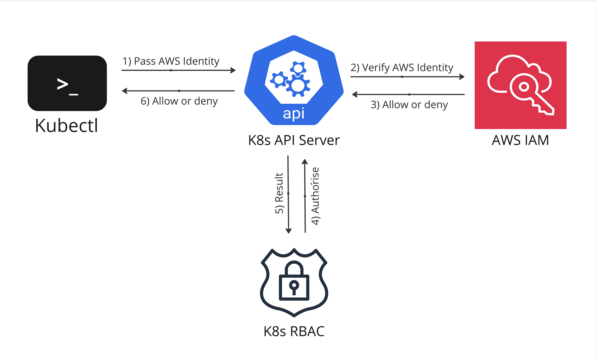
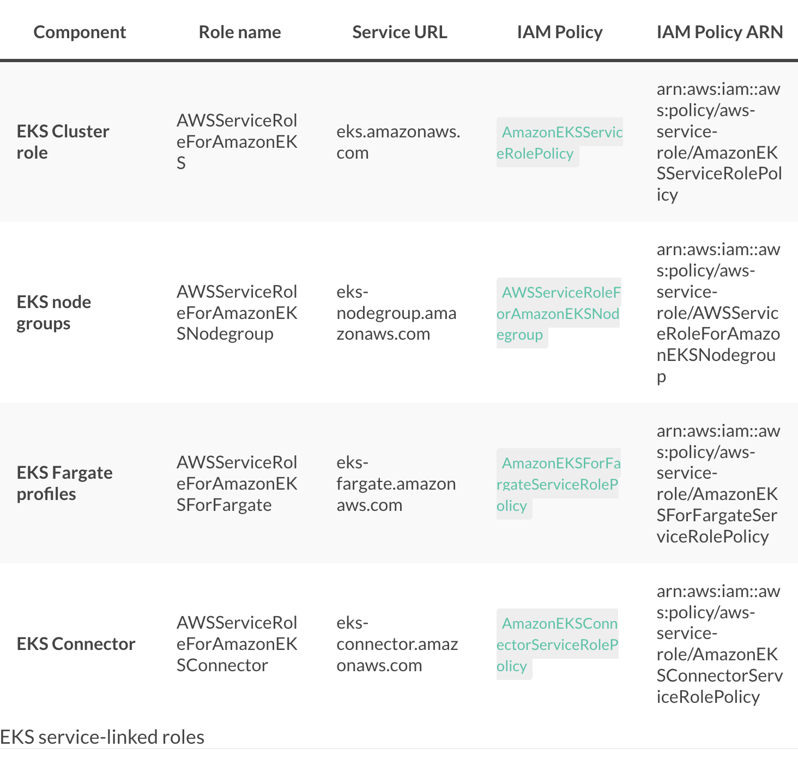

### EKS Cluster Authentication

All permissions are essentially managed by Kubernetes Role Based Access Control (RBAC). However AWS IAM is involved.



#### Prerequisites
Prior to creating your EKS cluster be sure to identify which IAM role or user will be the “primary” identity to create the EKS cluster. The identity that first creates the EKS cluster will be automatically added to K8s system:masters group.

#### Amazon EKS IAM Resource
The Amazon EKS cluster resource has the following ARN:

```bash
arn:${Partition}:eks:${Region}:${Account}:cluster/${ClusterName}
```

#### IAM policies based on the cluster name

**Read/View all clusters**: Terraform IAM example

Initially the user or role may not have any EKS permissions, so if you attempt to list all the clusters it would return an error like this.

Run the following command:
```bash
aws eks list-clusters
```

```bash
An error occurred (AccessDeniedException) when calling the ListClusters operation: User: arn:aws:iam::619071340100:user/terraform-eks is not authorized to perform: eks:ListClusters on resource: arn:aws:eks:ap-southeast-2:619071340100:cluster/*
```

The “eks:ListClusters” Resource must not be restricted so therefore it’s in a different statement than the other actions that do allow the EKS resource ARN. See example below.

```hcl
data "aws_iam_policy_document" "read_all_eks_clusters" {
  statement {
    sid = "ReadAllEKSclusters"
    actions = [
      "eks:AccessKubernetesApi",
      "eks:DescribeCluster",
      "eks:ListAddons",
      "eks:ListFargateProfiles",
      "eks:ListIdentityProviderConfigs",
      "eks:ListNodegroups",
      "eks:ListTagsForResource",
      "eks:ListUpdates"
    ]
    resources = [
      "arn:aws:eks:${var.region}:${data.aws_caller_identity.current.account_id}:cluster/*",
    ]
  }

  statement {
    sid = "ListAllEKSclusters"
    actions = [
      "eks:ListClusters"
    ]
    resources = [
      "*"
    ]
  }
}
```

Rerun list cluster action with this newly attached policy.

```bash
aws eks list-clusters

# My results
{
    "clusters": [
        "cluster-one-eks-aLqPeQgV"
    ]
}
```

The “Describe cluster” action and few others will require the exact name of the cluster you want to describe and because the ARN is set to all (asterisk in the ARN) that means this policy allows describing all clusters.

```bash
aws eks describe-cluster --name cluster-one-eks-aLqPeQgV

# result
{
    "cluster": {
        "name": "cluster-one-eks-aLqPeQgV",
        "arn": "arn:aws:eks:ap-southeast-2:619071340100:cluster/cluster-one-eks-aLqPeQgV",
        "createdAt": "2024-09-18T15:21:51.337000+12:00",
        "version": "1.29",
        "endpoint": "https://F9676B8ABEEDA9C4D5B7F62BD7D20DF8.gr7.ap-southeast-2.eks.amazonaws.com",
        "roleArn": "arn:aws:iam::619071340100:role/cluster-one-eks-aLqPeQgV-cluster-20240918032121901300000003",
        "resourcesVpcConfig": {
            "subnetIds": [
                "subnet-0f281f04451f3197d",
                "subnet-0ab85b87eff9210b4",
                "subnet-03062ce912fd51d5f"
            ],
            "securityGroupIds": [
                "sg-0ae07b0d051afd210"
            ],
            "clusterSecurityGroupId": "sg-0c317a3b3a63fc6a0",
            "vpcId": "vpc-0dd4f5391070f21a2",
...
}
```


#### Other IAM policies
EKS Console Admin policy: This permission will allow full read and write to the Configuration tab on the EKS console. The Resources and the Overview tabs requires Kubernetes RBAC permissions.

```hcl
data "aws_iam_policy_document" "console_admin" {

  statement {
    sid = "admin"

    actions = [
      "eks:*"
    ]

    resources = [
      "*"
    ]
  }

  statement {
    sid = "console"

    effect = "Allow"
    actions = [
      "iam:PassRole"
    ]

    resources = [
      "*"
    ]

    condition {
      test     = "StringEquals"
      variable = "iam:PassedToService"
      values   = ["eks.amazonaws.com"]
    }
  }
}
```

#### Update a Kubernetes cluster version
This policy will only allow to update just the Kubernetes Cluster version. In the Terraform example below, updating the cluster version is only allowed when the EKS cluster has a tag of “environment” and a value of “Dev”; the EKS cluster that’s in the current account and region of course.

```hcl
data "aws_iam_policy_document" "cluster_version" {

  statement {
    sid = "admin"

    actions = [
      "eks:UpdateClusterVersion"
    ]

    resources = [
      "arn:aws:eks:${var.region}:${data.aws_caller_identity.current.account_id}:cluster/*"
    ]

    condition {
      test     = "StringEquals"
      variable = "aws:ResourceTag/environment"
      values   = ["sandbox"]
    }
  }
}
```

#### EKS Service-linked roles
The following table shows all the service-linked roles that are automatically created when you create the cluster and its components.



## EKS IAM Roles
#### Amazon EKS Cluster Role
The AmazonEKSClusterPolicy is required to be attached to your EKS Cluster role before you create your cluster.

The `sts:AssumeRole` action in AWS Identity and Access Management (IAM) allows a user or service to assume a role. When a user or service assumes a role, they temporarily gain the permissions associated with that role. This is useful for granting access to resources across different AWS accounts or for limiting permissions to specific tasks.

**Temporary Security Credentials:** When a role is assumed, AWS Security Token Service (STS) provides temporary security credentials (access key ID, secret access key, and session token) that can be used to access AWS resources.
**Cross-Account Access:** sts:AssumeRole is commonly used to grant access to resources in another AWS account. For example, an IAM user in Account A can assume a role in Account B to access resources in Account B.
**Least Privilege:** By using roles, you can enforce the principle of least privilege, granting only the permissions necessary for a specific task.
**Session Duration:** The temporary credentials have a limited lifespan, which can be specified when assuming the role. The default session duration is one hour, but it can be set to a value between 15 minutes and 12 hours.

Below defines an AWS IAM role specifically for an Amazon EKS cluster.

```hcl
# This defines a new IAM role resource in Terraform with the name eks_cluster_role.
resource "aws_iam_role" "eks_cluster_role" {
  name = "eks-cluster-role"
  tags = local.required_tags

# This defines the trust policy for the IAM role. The trust policy specifies who (which entities) can assume the role.
  assume_role_policy = <<POLICY
{
  "Version": "2012-10-17",
  "Statement": [
    {
      "Effect": "Allow",
      # Principal: Specifies the entity that can assume the role. In this case, it is the EKS service (eks.amazonaws.com).
      "Principal": {
        "Service": "eks.amazonaws.com"
      },
      # Specifies the action that is allowed. Here, it is sts:AssumeRole, which allows the EKS service to assume this role.
      "Action": "sts:AssumeRole"
    }
  ]
}
POLICY
}

resource "aws_iam_role_policy_attachment" "eks_cluster_role" {
  policy_arn = "arn:aws:iam::aws:policy/AmazonEKSClusterPolicy"
  role       = aws_iam_role.eks_cluster_role.name
}
```

What This Configuration Does:
Creates an IAM Role: The configuration creates an IAM role named eks-cluster-role.
Allows EKS to Assume the Role: The trust policy allows the EKS service to assume this role. This is necessary for EKS to manage resources on your behalf.

Usage:
This IAM role is typically used by an EKS cluster to interact with other AWS services on your behalf. For example, it might be used to create and manage EC2 instances, load balancers, and other resources required by the EKS cluster.


#### Amazon EKS node IAM role

Each node (EC2 instance for example) uses IAM roles to make AWS API calls. Before you can create and register nodes to the EKS cluster they must have an IAM role with the following policies attached AmazonEKSWorkerNodePolicy and AmazonEC2ContainerRegistryReadOnly. We’ll add the AmazonEKS_CNI_Policy later.

```hcl
locals {
  eks_node_policies = ["AmazonEC2ContainerRegistryReadOnly", "AmazonEKSWorkerNodePolicy"]
}

resource "aws_iam_role" "eks_node_role" {
  name = "eks-node-role"
  tags = local.required_tags

  assume_role_policy = <<POLICY
{
  "Version": "2012-10-17",
  "Statement": [
    {
      "Effect": "Allow",
      "Principal": {
        "Service": "ec2.amazonaws.com"
      },
      "Action": "sts:AssumeRole"
    }
  ]
}
POLICY
}

resource "aws_iam_role_policy_attachment" "eks_node_role" {
  for_each = toset(local.eks_node_policies)

  policy_arn = "arn:aws:iam::aws:policy/${each.value}"
  role       = aws_iam_role.eks_node_role.name
}
```

#### Amazon EKS CNI Policy

You can attach the AmazonEKS_CNI_Policy to the node role above. However, you must follow least privilege model to protect your nodes as much as possible. We’ll need to create the IAM roles for Kubernetes service account or IRSA.

**AWS VPC CNI Plugin:** The module likely sets up the Amazon VPC CNI (Container Network Interface) plugin for Kubernetes. This plugin is used by Amazon EKS to provide networking for Kubernetes pods. It allows Kubernetes pods to have the same IP address inside the pod as they do on the VPC network, enabling seamless communication between pods and other AWS services.

```hcl
{
  addon_context = {
    aws_caller_identity_account_id = data.aws_caller_identity.current.account_id
    aws_caller_identity_arn        = data.aws_caller_identity.current.arn
    aws_eks_cluster_endpoint       = data.aws_eks_cluster.eks_cluster.endpoint
    aws_partition_id               = data.aws_partition.current.partition
    aws_region_name                = data.aws_region.current.name
    eks_oidc_issuer_url            = local.eks_oidc_issuer_url
    eks_cluster_id                 = aws_eks_cluster.simple_example.id
    eks_oidc_provider_arn          = "arn:${data.aws_partition.current.partition}:iam::${data.aws_caller_identity.current.account_id}:oidc-provider/${local.eks_oidc_issuer_url}"
    irsa_iam_role_path             = "/"
    irsa_iam_permissions_boundary  = ""
    tags                           = local.required_tags
  }

  addon_config = {
    kubernetes_version = "1.21" #eks_cluster_version
  }
}

module "vpc_cni_irsa" {
  source  = "bootlabstech/fully-loaded-eks-cluster/aws//modules/kubernetes-addons/aws-vpc-cni"
  version = "1.0.7"
  # kubernetes_namespace              = "kube-system"
  # kubernetes_service_account        = "aws-node"
  # create_kubernetes_namespace       = false
  # create_kubernetes_service_account = false
  # irsa_iam_policies                 = ["arn:aws:iam::aws:policy/AmazonEKS_CNI_Policy"]
  # irsa_iam_role_path                = "/" 
  addon_context      = local.addon_context
  addon_config       = local.addon_config
}
```

#### EKS Fargate profiles

We cannot use the node IAM role for the EKS Farget profiles, we have to create a pod execution IAM role. Kubernetes Role based access control (RBAC) will use this pod execution IAM role for authorization to AWS services, for example to pull an image from Amazon Elastic Container Registry (ECR). The code below creates the Amazon EKS pod execution IAM role with the required policy and trust settings.

Amazon EKS Fargate profiles are used to define which pods should run on Fargate, which is AWS's serverless compute engine for containers. Fargate profiles allow you to specify which pods should run on Fargate and which should run on Amazon EC2 instances. This can help you manage and optimize your compute resources more effectively.

Key Uses of EKS Fargate Profiles
**Serverless Compute:** Fargate profiles allow you to run Kubernetes pods without having to manage the underlying EC2 instances. AWS Fargate automatically provisions and scales the compute resources needed to run your pods.
**Simplified Management:** By using Fargate profiles, you can simplify the management of your Kubernetes cluster. You don't need to worry about provisioning, configuring, or scaling the EC2 instances that your pods run on.
**Cost Optimization:** Fargate profiles can help optimize costs by allowing you to run only the necessary compute resources. You pay only for the vCPU and memory resources that your pods use.
**Security and Isolation:** Fargate provides better isolation for your pods, as each pod runs in its own dedicated environment. This can enhance the security of your applications.
**Workload Segmentation:** You can use Fargate profiles to segment different types of workloads. For example, you can run stateless applications on Fargate while running stateful applications on EC2 instances.

```hcl
resource "aws_iam_role" "eks_pod_exe_role" {
  name = "eks-fargate-pod-execution-role"
  tags = local.required_tags

  assume_role_policy = <<POLICY
{
  "Version": "2012-10-17",
  "Statement": [
    {
      "Effect": "Allow",
      "Principal": {
        "Service": "eks-fargate-pods.amazonaws.com"
      },
      "Action": "sts:AssumeRole",
      "Condition": {
         "ArnLike": {
            "aws:SourceArn": "arn:aws:eks:${var.region}:${data.aws_caller_identity.current.account_id}:fargateprofile/${local.cluster_name}/*"
         }
      }
    }
  ]
}
POLICY
}

resource "aws_iam_role_policy_attachment" "eks_pod_exe_role" {
  policy_arn = "arn:aws:iam::aws:policy/AmazonEKSFargatePodExecutionRolePolicy"
  role       = aws_iam_role.eks_pod_exe_role.name
}
```

#### EKS Connector

This is a read or view only feature to see your Kubernetes clusters from your other cloud providers or on-premises or running on your EC2s. This also needs a different IAM role.